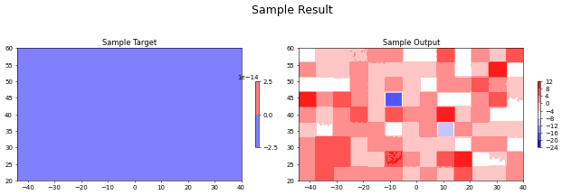

```python
# !jupyter nbconvert --output-dir='html' --to html training_vit_pv_to_z500.ipynb
# !jupyter nbconvert --output-dir='script' --to markdown training_vit_pv_to_z500.ipynb
```


```python
import torch
import torch.nn as nn
import numpy as np
from torch.utils.data import Dataset,DataLoader
import timm.models.vision_transformer as ViT
import matplotlib.pyplot as plt
from torch.utils.data.dataloader import default_collate 

from tqdm import tqdm

import sys
sys.path.insert(0, '../../packages/')
from models.ViTtoMap import *
from training.dataset_handlers.MapsToMapsDataset_NoAugmentation import *
from training.training_loops.train_model_maps_to_maps import *

```


```python
location = "wexac"

if location == "wexac":
    data_dir = "/home/labs/rudich/Collaboration/dust_prediction/data/pv_to_z500_wide/datasets/"
    results_dir = "/home/labs/rudich/Collaboration/dust_prediction/results/pv_to_z500_wide/"
    debug_dir = data_dir+"debug/"
    
datasets_paths = []
for i in range(1,6):
    split_dict = {}
    for data_type in ["train", "valid"]:
        paths_dict = {"input": data_dir+"split"+str(i)+"_"+data_type+"_input.pkl",
                      "target": data_dir+"split"+str(i)+"_"+data_type+"_target.pkl",
                      "timestamps": data_dir+"split"+str(i)+"_"+data_type+"_timestamps.pkl"}
        split_dict[data_type] = paths_dict
    datasets_paths.append(split_dict)
```


```python
datasets_paths[0]["valid"]
```


    {'input': '/home/labs/rudich/Collaboration/dust_prediction/data/pv_to_z500_wide/datasets/split1_valid_input.pkl',
     'target': '/home/labs/rudich/Collaboration/dust_prediction/data/pv_to_z500_wide/datasets/split1_valid_target.pkl',
     'timestamps': '/home/labs/rudich/Collaboration/dust_prediction/data/pv_to_z500_wide/datasets/split1_valid_timestamps.pkl'}


```python
device = torch.device('cuda' if torch.cuda.is_available() else 'cpu')
device
```


    device(type='cuda')


```python
# debug_train_input = torch.load(datasets_paths[0]["train"]["input"])[:200]
# debug_train_target = torch.load(datasets_paths[0]["train"]["target"])[:200]
# debug_train_timestamps = torch.load(datasets_paths[0]["train"]["timestamps"])[:200]
# debug_valid_input = torch.load(datasets_paths[0]["valid"]["input"])[:200]
# debug_valid_target = torch.load(datasets_paths[0]["valid"]["target"])[:200]
# debug_valid_timestamps = torch.load(datasets_paths[0]["valid"]["timestamps"])[:200]

# torch.save(debug_train_input,debug_dir+"debug_train_input.pkl")
# torch.save(debug_train_target,debug_dir+"debug_train_target.pkl")
# torch.save(debug_train_timestamps,debug_dir+"debug_train_timestamps.pkl")
# torch.save(debug_valid_input,debug_dir+"debug_valid_input.pkl")
# torch.save(debug_valid_target,debug_dir+"debug_valid_target.pkl")
# torch.save(debug_valid_timestamps,debug_dir+"debug_valid_timestamps.pkl")

```


```python

```


```python
# train_dataset = MapsToMapsDataset_NoAugmentation(torch.load(datasets_paths[0]["train"]["input"][:2000]),
#                                                  torch.load(datasets_paths[0]["train"]["target"][:2000]),
#                                                  torch.load(datasets_paths[0]["train"]["timestamps"][:2000]))
# valid_dataset = MapsToMapsDataset_NoAugmentation(torch.load(datasets_paths[0]["valid"]["input"][:2000]),
#                                                  torch.load(datasets_paths[0]["valid"]["target"][:2000]),
#                                                  torch.load(datasets_paths[0]["valid"]["timestamps"][:2000]))

# train_dataset = MapsToMapsDataset_NoAugmentation(torch.load(debug_dir+"debug_train_input.pkl"),
#                                                  torch.load(debug_dir+"debug_train_target.pkl"),
#                                                  torch.load(debug_dir+"debug_train_timestamps.pkl"))
# valid_dataset = MapsToMapsDataset_NoAugmentation(torch.load(debug_dir+"debug_valid_input.pkl"),
#                                                  torch.load(debug_dir+"debug_valid_target.pkl"),
#                                                  torch.load(debug_dir+"debug_valid_timestamps.pkl"))

# train_loader = DataLoader(train_dataset, batch_size=8, shuffle=True)
# valid_loader = DataLoader(valid_dataset, batch_size=8, shuffle=True)

# vit = ViT.VisionTransformer(img_size=(81,169), patch_size=(9,13), in_chans=7, num_classes=10, embed_dim=512, depth=8,
#                  num_heads=8, mlp_ratio=1., qkv_bias=True, representation_size=None, distilled=False,
#                  drop_rate=0., attn_drop_rate=0., drop_path_rate=0.)

# model = ViTtoMap(vit, output_shape=[1,81,169], patch_shape=[9,13])
# model = model.to(device)

```


```python
# print([m for m in model.modules()])
# print(len(train_dataset))
```


```python

```


```python

# lr = 0.01
# optimizer = torch.optim.Adam(model.parameters(), lr=lr)

# results_dir_path = results_dir+"debug/"

# criterion = nn.MSELoss()

# num_epochs = 2
# (train_losses,valid_losses) = train_loop(model, optimizer, train_loader, valid_loader, device, num_epochs, criterion, 
#                                          valid_every=1, sample_outputs_every=1, sample_size=5, loss_plot_end=True, 
#                                          debug=False, save_to_dir=results_dir_path, scheduler=None)
    
```


```python
train_dataset = MapsToMapsDataset_NoAugmentation(torch.load(datasets_paths[0]["train"]["input"]),
                                                 torch.load(datasets_paths[0]["train"]["target"]),
                                                 torch.load(datasets_paths[0]["train"]["timestamps"]))
valid_dataset = MapsToMapsDataset_NoAugmentation(torch.load(datasets_paths[0]["valid"]["input"]),
                                                 torch.load(datasets_paths[0]["valid"]["target"]),
                                                 torch.load(datasets_paths[0]["valid"]["timestamps"]))

train_loader = DataLoader(train_dataset, batch_size=8, shuffle=True)
valid_loader = DataLoader(valid_dataset, batch_size=8, shuffle=True)

vit = ViT.VisionTransformer(img_size=(81,169), patch_size=(9,13), in_chans=7, num_classes=10, embed_dim=512, depth=8,
                 num_heads=8, mlp_ratio=1., qkv_bias=True, representation_size=None, distilled=False,
                 drop_rate=0., attn_drop_rate=0., drop_path_rate=0.)

model = ViTtoMap(vit, output_shape=[1,81,169], patch_shape=[9,13])
model = model.to(device)
lr = 0.01
optimizer = torch.optim.Adam(model.parameters(), lr=lr)

results_dir_path = results_dir+"split1_test1/"

criterion = nn.MSELoss()

num_epochs = 10
(train_losses,valid_losses) = train_loop(model, optimizer, train_loader, valid_loader, device, num_epochs, criterion, 
                                         valid_every=1, sample_outputs_every=1, sample_size=1, loss_plot_end=True, 
                                         debug=False, save_to_dir=results_dir_path, scheduler=None)
```

    Training... 
    
    
    Train   Epoch: 001 / 010   Loss: 9.002e+04
    Valid   Epoch: 001 / 010   Loss:    5150


    <Figure size 432x288 with 0 Axes>


    

    


```python

```
